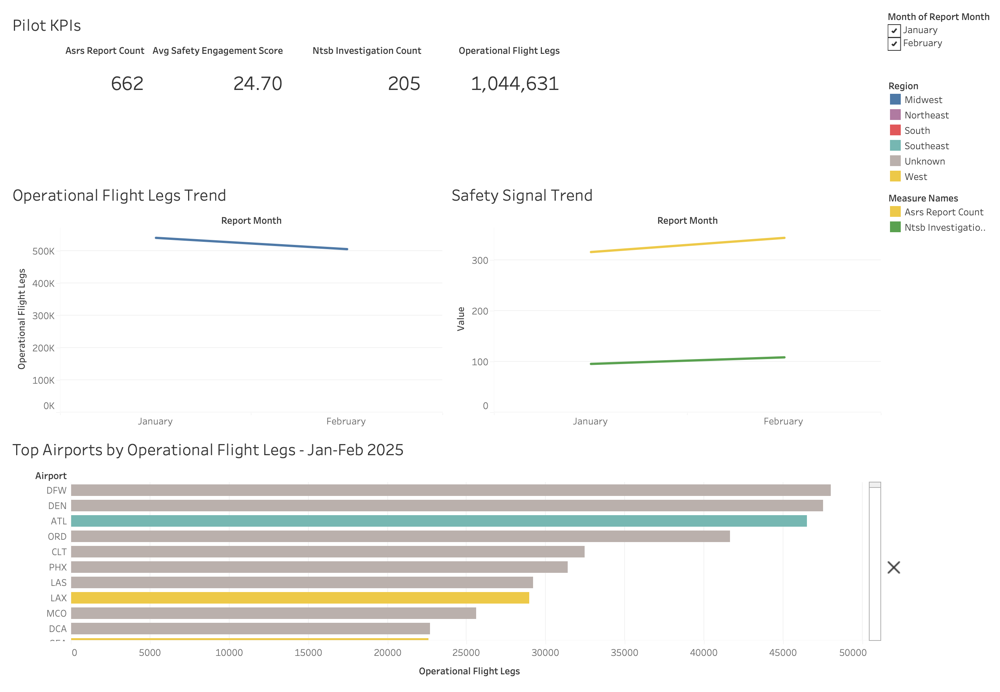
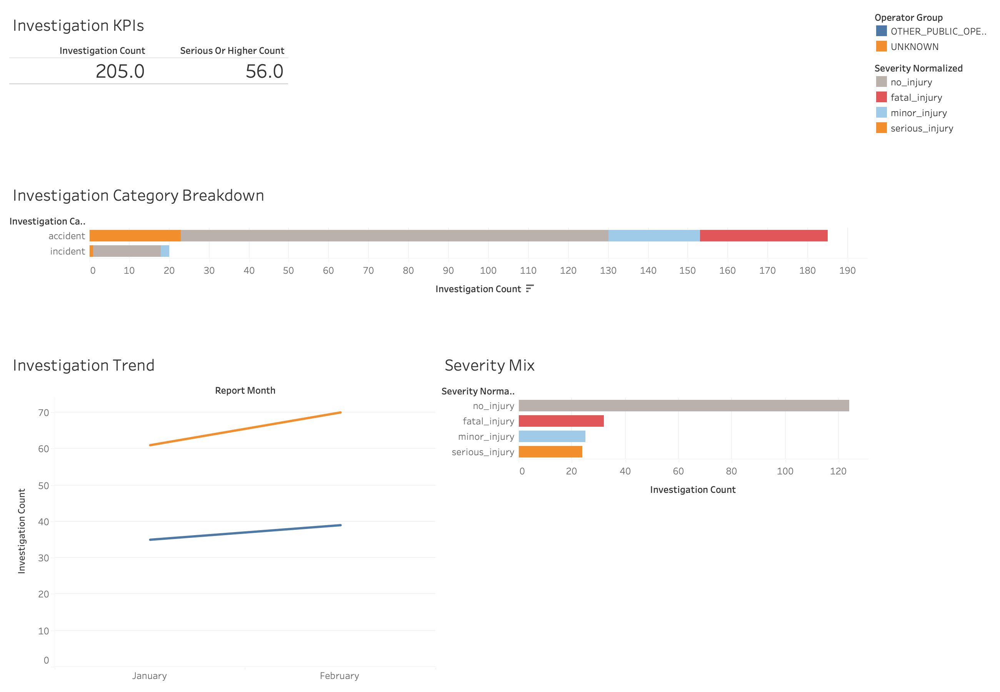
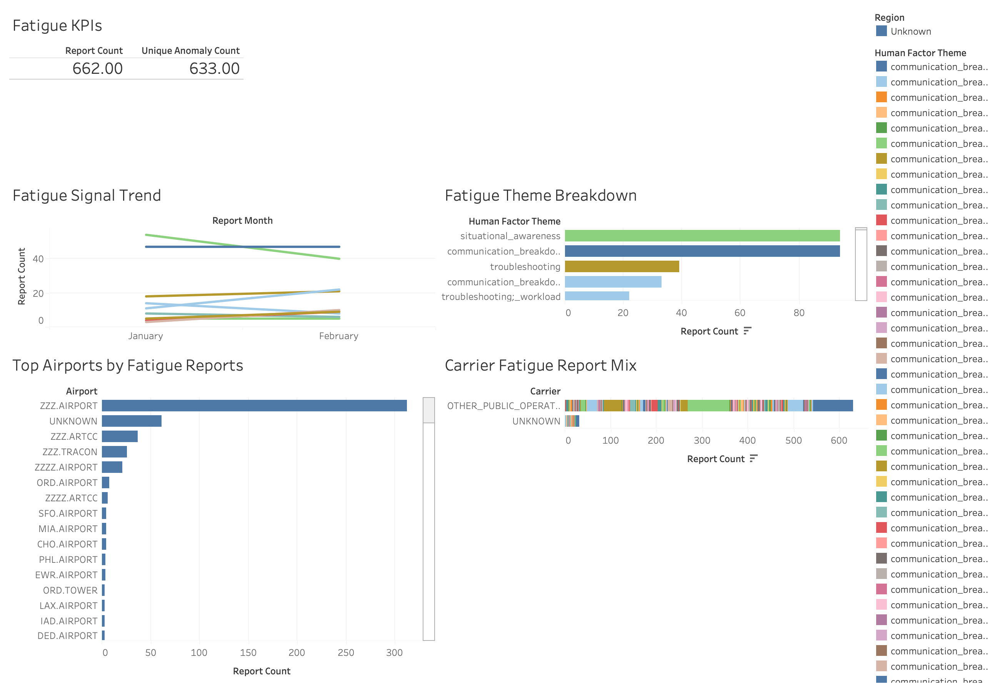

# Flight Safety Risk Intelligence Platform

## Overview
Flight Safety Risk Intelligence Platform is an end-to-end aviation analytics project built with public and synthetic data. It combines operational disruption data, voluntary safety reports, investigation context, and fatigue-related narrative analysis through a raw → trusted → analytics pipeline and Tableau dashboards.

## Public Data and Proxy Scope
This project does **not** use confidential airline FOQA, ASAP, or internal Safety Management System data.

Instead, it uses clearly labeled public or synthetic proxies:
- **BTS On-Time / Delay** as an operational context proxy
- **NASA ASRS** as a voluntary safety-report and human-factors proxy
- **NTSB aviation investigation data** as investigation context
- **Synthetic safety-culture data** as a clearly labeled proxy for the pilot phase

All cross-source integration is aggregate-only and explicitly framed as proxy-based.

## Architecture
The platform follows an AWS-style layered design:

- **Raw layer**: source-aligned public and synthetic files
- **Trusted layer**: standardized, validated, privacy-aware outputs
- **Analytics layer**: dashboard-ready marts and summary datasets

Tech stack:
- **Python** for ingestion, transformation, feature engineering, and analytics
- **SQL / warehouse-style marts** for structured analytical modeling
- **Tableau** for dashboarding and presentation
- **CSV-based local pilot workflow** for easy reproducibility

## Data Sources
### 1. BTS On-Time / Delay
Used as the operational context layer for flight volume, delays, cancellations, and diversions.

### 2. NASA ASRS
Used as a public voluntary safety-report source for fatigue and human-factor themes.

A lightweight rule-based NLP baseline enriches the trusted ASRS pilot extract for manual review and later benchmarking. It stays within the Jan-Feb 2025 window and uses the trusted location/operator equivalents found in the source file.

### 3. NTSB Aviation Investigations
Used as external investigation and severity context.

### 4. Synthetic Safety Culture
Used in the current pilot as a clearly labeled synthetic proxy for safety culture / training indicators.

## Dashboard 1: Monthly Risk Overview


What it shows:
- operational flight volume across the Jan–Feb 2025 pilot window
- ASRS report activity and investigation context
- high-level KPI view for the pilot
- airport-level operational concentration

Why it matters: This dashboard provides a high-level view of how public operational and safety proxy signals can be combined into a monthly flight safety monitoring story.

## Dashboard 2: Investigation Trends


What it shows:
- NTSB investigation counts across the pilot window
- investigation category distribution
- severity mix
- investigation trend context

Why it matters: This dashboard adds external investigation context and severity patterns to the broader safety analytics story.

## Dashboard 3: Fatigue Theme Trends


What it shows:
- ASRS-derived fatigue and human-factor theme signals
- top fatigue-related themes
- report concentration by carrier/theme grouping
- Jan–Feb 2025 trend movement

Why it matters: This dashboard shows how voluntary public safety-report narratives can be analyzed for fatigue-related and human-factor signal patterns.

## Current Release Scope
The current public release covers January 2025 and February 2025.

This release is intentionally scoped to a focused pilot window so the ingestion pipeline, analytics outputs, dashboards, NLP baseline, and fatigue benchmark workflow remain clear, reproducible, and easy to review.

## ASRS Fatigue Benchmark
The first benchmark model uses TF-IDF features from `narrative_clean` and a class-balanced logistic regression to predict the proxy label `weak_fatigue_label`. It uses 3-fold stratified cross-validation and writes compact validation artifacts for manual review.

## ASRS Fatigue Feature Engineering
The next ASRS feature pass turns `narrative_clean` into a small, transparent feature table with explicit fatigue counts, rest/sleep/duty context, hypothetical wording guards, and operational-noise counts. The output is keyed by `report_id` and preserves `weak_fatigue_label` so the second benchmark can be built without re-deriving the proxy target.

## Key Caveats
- This is a **public-data-based, proxy-driven** project.
- It does **not** represent internal airline operational telemetry.
- ASRS is a voluntary reporting source and is not equivalent to ASAP.
- BTS is an operational proxy and not FOQA.
- NTSB investigations are external records and may lag actual event timing.
- Synthetic safety-culture data is clearly labeled and used only where a truthful public substitute was not practical in this pilot phase.

## How to Re-run the Pipeline
From the project root:

```bash
source .venv/bin/activate
python -m src.transform.build_trusted_layer
python -m src.features.build_analytics_marts
python -m src.features.build_asrs_nlp_baseline
python -m src.features.build_asrs_fatigue_features
python -m src.models.train_asrs_fatigue_benchmark
```

That baseline writes `data/analytics/asrs_nlp_enriched.csv`.
The benchmark writes `data/analytics/asrs_fatigue_model_summary.json` and `data/analytics/asrs_fatigue_predictions.csv`.
The feature-engineering step writes `data/analytics/asrs_fatigue_features.csv`.
